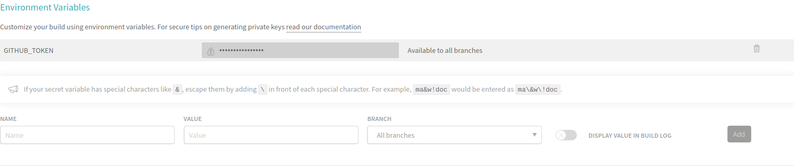

# Wasm template for Rust hosting without npm-deploy on github pages using Travis script

Last updated: 10th-March-2023

[](https://app.travis-ci.com/sn99/wasm-template-rust)

It automatically hosts you wasm projects on gh-pages using a travis script on the latest commit.

## Requirements
- [`rust-toolchain`](https://www.rust-lang.org/tools/install)
- [`wasm-pack`](https://rustwasm.github.io/wasm-pack/installer/)
- [`npm`](https://www.npmjs.com/get-npm)


## Steps : 
### For building :
- [Download](https://codeload.github.com/sn99/wasm-template-rust/zip/master) the template as it is
- Change [`Cargo.toml`](https://github.com/sn99/wasm-template-rust/blob/master/Cargo.toml) to suit yourself
- Change [`www/package.json`](https://github.com/sn99/wasm-template-rust/blob/master/www/package.json) to suit yourself, also remember to change 
```json 
  "dependencies": {
    "wasm-template-rust": "file:../pkg"
  },
```
Into : 
```json 
  "dependencies": {
    "YOUR-PROJECT-NAME-SAME-AS-IN-CARGO.toml": "file:../pkg"
  },
``` 
- Run `wasm-pack build` inside your project dictionary
- Run `npm install` inside [`www`](https://github.com/sn99/wasm-template-rust/tree/master/www) folder
- Next, modify [`www/index.js`](https://github.com/sn99/wasm-template-rust/blob/master/www/index.js) to import your `PROJECT` instead of the `wasm-template-rust` package
- Again run `npm install` inside [`www`](https://github.com/sn99/wasm-template-rust/tree/master/www) folder (just to be sure)
- Finally run `npm run start` inside [`www`](https://github.com/sn99/wasm-template-rust/tree/master/www) and visit http://localhost:8080 to see the results

### For deployment :
The template comes with a preconfigured [`.travis.yml`](https://github.com/sn99/wasm-template-rust/blob/master/.travis.yml) but you will still need to :
- Create a [new branch](https://help.github.com/en/github/collaborating-with-issues-and-pull-requests/creating-and-deleting-branches-within-your-repository) by the name [`gh-pages`](https://github.com/sn99/wasm-template-rust/tree/gh-pages)
- [Github pages](https://pages.github.com/) should be enabled by default but if not go to `Settings -> GitHub Pages` and enable it on your `gh-pages` branch. You will also find the link to your to-be hosted page there
- Make a [personal access token](https://help.github.com/en/github/authenticating-to-github/creating-a-personal-access-token-for-the-command-line) (only the token no need for command line here)
- Next we will need to put this token [into our travis](https://docs.travis-ci.com/user/deployment/pages/) settings, go to `more options -> settings -> Environment Variables` and enter the token `value` (the generated token code) and `name` as `GITHUB_TOKEN`, it should look like :


### Additional : 
- Update [LICENSE-MIT](https://github.com/sn99/wasm-template-rust/blob/master/LICENSE-MIT) and [LICENSE-APACHE](https://github.com/sn99/wasm-template-rust/blob/master/LICENSE-APACHE) to reflect your name and year
- Read [Rust and WebAssembly](https://rustwasm.github.io/docs/book/introduction.html) 
- Also read [wasm-pack](https://rustwasm.github.io/docs/wasm-pack/tutorials/hybrid-applications-with-webpack/index.html)
- Also see [wasm-conway](https://github.com/sn99/wasm-conway) made using [Rust 🦀 and WebAssembly 🕸](https://rustwasm.github.io/docs/book/) hosted at [gh-pages](https://sn99.github.io/wasm-conway/)

## License

Licensed under either of these:

 * Apache License, Version 2.0, ([LICENSE-APACHE](LICENSE-APACHE) or
   https://www.apache.org/licenses/LICENSE-2.0)
 * MIT license ([LICENSE-MIT](LICENSE-MIT) or
   https://opensource.org/licenses/MIT)
